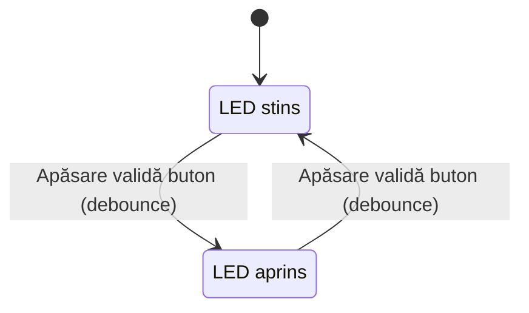
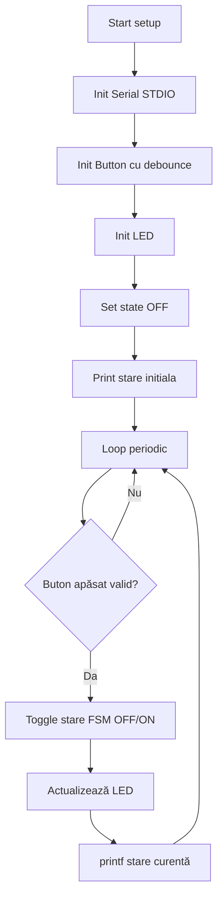
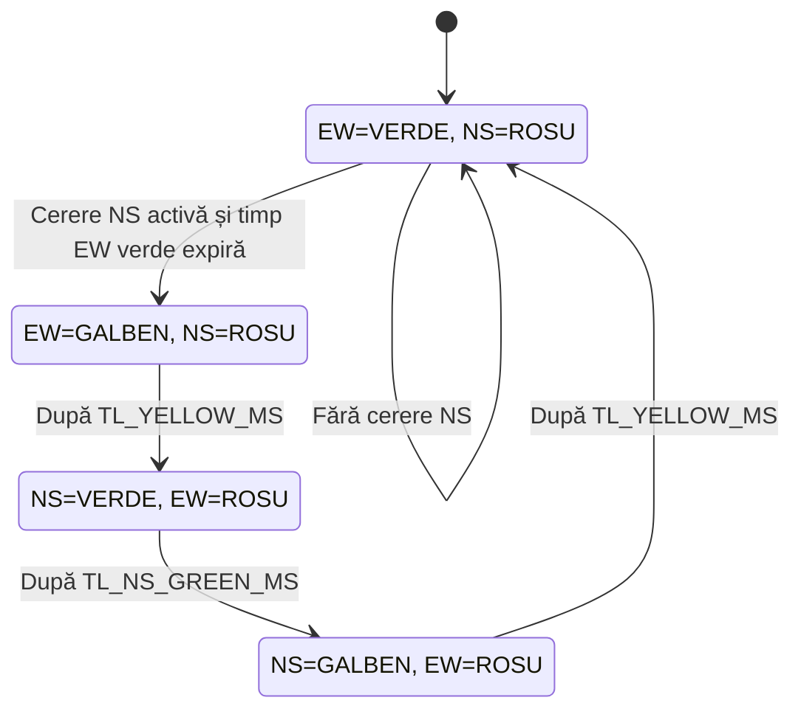
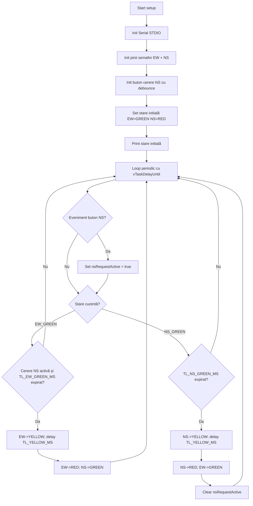

# Diagrame Mermaid - Lab 6

Acest fișier conține cod Mermaid pentru:
- schema bloc FSM
- flowchart de execuție

pentru fiecare sarcină: `app_lab_6_1` și `app_lab_6_2`.

## Sarcina 1 - `app_lab_6_1` (LED + buton)

### FSM

### FlowChart

## Sarcina 2 - `app_lab_6_2` (Semafor inteligent)

### FSM (intersecție globală)

### FlowChart

